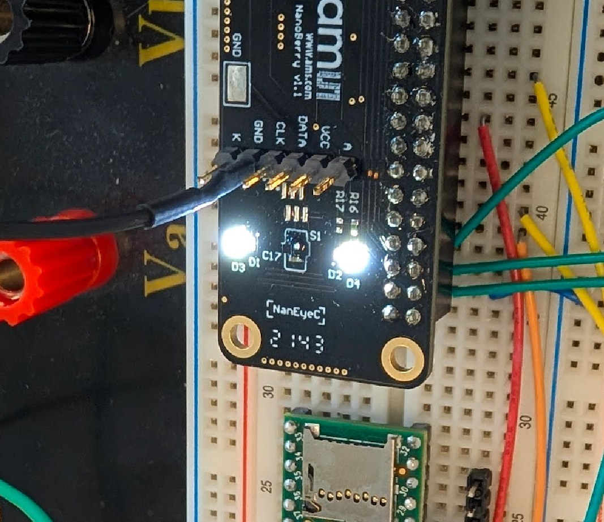
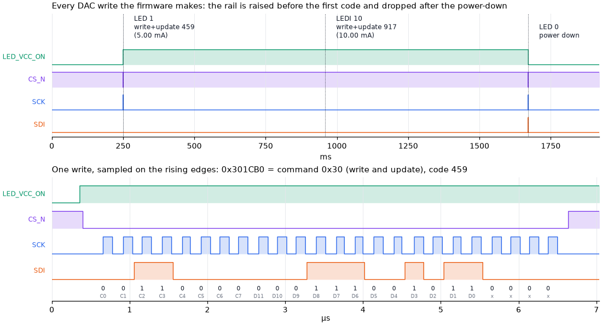
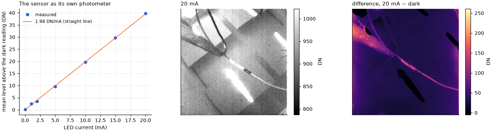

# Hardware and bring-up

How the Teensy is wired to the NanoBerry, why it is wired that way, and the staged
procedure used to bring the link up. To just build one, [Getting started](getting-started.md)
is shorter; this page is the full story behind it. Unfamiliar terms are in the
[glossary](glossary.md).

## The bench in the photo


| In the photo | What it is |
|---|---|
| Green board on the left of the breadboard | **Teensy 4.1**, powered and connected to the PC by the black USB cable on the far left |
| Black board on the right, "ams" logo | **NanoBerry** with the NanEyeC. It plugs, by its 40-pin Raspberry Pi header `J2`, into a header socket on the breadboard, so every `J2` pin appears on a breadboard row |
| Short coloured wires on the breadboard | Teensy pins to `J2` pins: SCLK, SDAT, sensor enable, 5 V and ground ([table below](#wiring)) |
| Red box at the back | **Saleae Logic Pro 16** logic analyser. Its leads with white tips probe the Teensy side of the link and, clipped to the small header on top of the NanoBerry (`P1`), the sensor side. Development only; the camera runs without it |
| Red, black and green binding posts | Part of the breadboard, unused |

It is deliberately an ordinary breadboard build: jumper wires, no custom PCB. It still runs
at the full 49.5 MHz, because the firmware measures where to sample each bit
([clock rates](#clock-rates)).

## What is on the bench

- **NanoBerry board** with a NanEyeC mounted as `S1` (the monochrome version, confirmed by
  measurement). It exposes the sensor on a 40-pin Raspberry Pi header `J2`, and on `J1`
  (FPC) and `P1` (6-pin), which share the same sensor nets.
- **Teensy 4.1**: 600 MHz i.MX RT1062 microcontroller, 3.3 V I/O, not 5 V tolerant.
- **Saleae Logic Pro 16** (development only): 500 MS/s on a few channels, 250 MS/s with 7.

## Wiring

```
Teensy 27 ──────────────── J2.23 ──[R20 24R]── S1.B1  (SCLK)
Teensy 26 ─[100R]┐                             C11 15pF
Teensy  1 ───────┴─ tie at J2 ─ J2.19 ─[R23 24R]─ S1.B2  (SDAT, bidirectional)
                                               C13 15pF
Teensy  2 ──────────────── J2.33 ─ R19 10k pd ─ TPS71701 EN → VCC_SENSOR 3.3 V
Teensy  3 ──────────────── J2.31   LED_VCC_ON_1
Teensy  4 ──────────────── J2.36   LED_DAC_CS_N
Teensy  5 ──────────────── J2.38   LED_DAC_SDI
Teensy  6 ──────────────── J2.40   LED_DAC_SCK
Teensy VUSB ────────────── J2.2 / J2.4   (5vs)
Teensy GND ─────────────── J2.6, 14, 20, 25   (and J2.9 = GNDL if using the LEDs)
```

### Bench setup: connections and probe map

Each signal is listed with where it enters the NanoBerry and where the Saleae sees it.
The Logic Pro's eight probes are shared: D4–D6 sit either on the sensor end of the link or
on the LED DAC, never both at once, so the link figures and the
[LED figures](#illumination-measured) come from separate sessions.

| Signal | Teensy 4.1 | NanoBerry J2 | Board net → sensor pad | Saleae, Teensy side | Saleae, board side |
|---|---|---|---|---|---|
| SCLK | pin 27 (`LPSPI3_SCK`) | J2.23 | `NanEye_SCK_RP` → R20 24 Ω → **S1.B1** (SCLK/DATA−) | **D3** | **D6** |
| SDAT, out | pin 26 (`LPSPI3_SDO`) | J2.19, tied with pin 1 | `Naneye_Data_RP` → R23 24 Ω → **S1.B2** (SDAT/DATA+) | **D2** | **D5** |
| SDAT, in | pin 1 (`LPSPI3_SDI`) | J2.19, tied with pin 26 | same net as above | **D0** | **D5** |
| Sensor power enable | pin 2 | J2.33 | `Naneye_EN` → TPS71701 EN (R19 10 k pull-down) | **D1** | — |
| Sensor supply | — | — | `VCC_SENSOR`, TPS71701 output, 3.3 V → **S1.A1** (VDDA) | — | **D4** |
| 5 V | VUSB | J2.2 / J2.4 | `5vs` → TPS71701 input | — | — |
| LED boost enable | pin 3 | J2.31 | `LED_VCC_ON_1` → LT3473 SHDN | **D7** | — |
| LED DAC chip select | pin 4 | J2.36 | `LED_DAC_CS_N` → LTC2630 CS | **D4** | — |
| LED DAC data | pin 5 | J2.38 | `LED_DAC_SDI` → LTC2630 SDI | **D5** | — |
| LED DAC clock | pin 6 | J2.40 | `LED_DAC_SCK` → LTC2630 SCK | **D6** | — |
| Ground | GND | J2.6, 14, 20, 25 | `GND` → **S1.A2** (VSS) | Saleae GND | Saleae GND |
| *(unused)* | | | | D7 | |

Notes on the probe map:

- **D0 and D2 are the same net** once pins 1 and 26 are tied at J2.19, so they read
  identically; together they only confirm the tie. With the board disconnected they differ,
  which is how the no-sensor captures could see pin 26's drive separately from pin 1.
- **D5 is SDAT on the sensor side of R23.** Compared with D0/D2 it shows what the resistor
  and wiring do to the edges, and — since the sensor drives SDAT during readout — the return
  half of the round-trip delay. **D6 is SCLK on the board side**, likewise. On the board these nets are
  also brought out on P1: pin 2 `VCC_SENSOR`, pin 3 SDAT, pin 4 SCLK.
- **D4 sees the switched sensor rail**, not the 5 V input, so it should stay low until
  `POWER 1` and rise when EN does. Sampled as analog, it also shows the rail's ramp, which
  is what the firmware's 5 ms settle delay before the first clock is betting on.
- A probe adds roughly 10 pF plus lead capacitance to a node. On D5 that lands
  directly on the sensor's pads, in the timing-critical direction; worth remembering before
  reading setup margins at 49.5 MHz.

Pin choices are in `firmware/src/board.h`. LPSPI3 ("SPI1") fixes 27/26/1; LPSPI3 was picked
over the default LPSPI4 to keep a 12–50 MHz clock off pin 13 and its onboard LED
capacitance.

### R13 and R33 are not fitted

The schematic marks R13 and R33 NoBom, and on this board they are indeed absent. They are
10k pull-downs on the header side of the SDAT and SCLK series resistors, there to hold both
nets low whenever nothing drives them. Without them, and with `SPI1.begin()` configuring the
pads as `DSE(7) | SPEED(2)` — no pull at all — both nets float when undriven.

| Net | Floats when | Why it matters |
|---|---|---|
| SCLK | before `seim::begin()`, and while LPSPI is reset or reconfigured (`CLK`, `SAMPLE`) | The sensor advances on clock edges. Noise on a floating SCLK while the sensor is powered can inject an edge and slip the 12-bit word alignment for the rest of the session, with no error until rows start failing validation |
| SDAT | after `STOP`, before `START`, at every hand-over between drivers | Less dangerous — the sensor samples SDAT only on clock edges — but a floating CMOS input is untidy and the datasheet specifically warns about EMI pickup |

**The firmware now enables the i.MX RT pads' internal 100k pull-downs** on pin 27 (SCLK) and
on both SDAT pins (26 and 1), applied after `SPI1.begin()` and preserved across the
bit-bang hand-backs. No hardware change is needed.

The internal pull-down is ten times weaker than the 10k the board was designed for. That
still defines the DC level, which is what matters here, but it settles more slowly
(100k × ~35 pF ≈ 3.5 µs) and holds less firmly against coupled noise. If you see SCLK or
SDAT wander on the Saleae while idle, **fit 10k at R13 and R33** — the pads are on the
board. Loading is not a concern at that value: 0.33 mA against a sensor driver of 3.9–9.6 mA.

Board population, checked part by part: **R19, R20 and R23 are fitted**, **R13 and R33 are
not**. The three fitted ones are the parts this design cannot do without — R23 carries SDAT
to the sensor, R20 carries SCLK, and R19 keeps the sensor unpowered until the Teensy drives
`NanEye_EN`, which also means SCLK cannot glitch the sensor before the firmware runs.

### Recommended: a series resistor on pin 26

Fit **100 Ω in series at pin 26**, close to the pin. Not on pin 27, and **not on pin 1**.

The hazard it addresses is contention — the Teensy driving SDAT while the sensor is also
driving it. §6.3.2.2 says that "would seriously degrade the data integrity and is not
qualified in terms of device reliability and lifetime": survivable, not warranted. It is
also not hypothetical. Review found exactly that bug in `start()`, where the alignment
clocks drove SDAT after idle had been cleared and the sensor had begun transmitting.
Firmware this young will likely have another.

Today the only thing between the two drivers is the board's `R23` = 24 Ω. The current in a
fight is bounded by both drivers' output impedances, so it is realistically tens of mA
rather than the 137 mA that 3.3 V / 24 Ω implies — but that bound depends on assumptions
about the sensor's output stage. A series resistor replaces the assumption with a number.

The cost lands only on the upstream direction (register writes), where the constraint is the
sensor's 3 ns setup before the SCLK rising edge. With node capacitance around 35 pF (C13's
15 pF, two Teensy pads, jumper wire, the J1/P1 stubs, the sensor pad):

| Series R (with R23) | Rise to 90 % | 12.375 MHz (37 ns budget) | 24.75 MHz (17 ns) | 49.5 MHz (7 ns) |
|---|---|---|---|---|
| 0 Ω (24 Ω) | ~2 ns | fine | fine | fine |
| 47 Ω (71 Ω) | ~6 ns | fine | fine | marginal |
| 100 Ω (124 Ω) | ~10 ns | fine | fine | too slow |
| 220 Ω (244 Ω) | ~20 ns | fine | marginal | no |

100 Ω is free at the planned 12.375–24.75 MHz (D6). Choose **47 Ω** instead if you want to
reach 49.5 MHz without rework.

Putting it on pin 26 alone has a second effect worth having: it isolates the SDO pad's ~5 pF
from the SDAT net during readout, since that capacitance then charges through the resistor.
That slightly unloads the sensor's driver, helping the *downstream* direction — the one with
only ~12 ns of setup at 49.5 MHz. So the resistor spends margin where there is 17–37 ns
spare and returns a little where there is 12 ns.

**Never on pin 1.** That is the receive path; a series resistor there forms an RC with the
input pad capacitance and delays what the Teensy samples, straight out of the critical setup
window, for no benefit at all.

!!! danger "Three things that will waste your afternoon"
    - **The sensor is powered off at reset.** `NanEye_EN` has a 10 k pulldown, so nothing
      responds until pin 2 is driven high. `POWER 1` does this; `START` does it implicitly.
    - **Nothing that drives a signal on `J1` or `P1`.** They sit on the same `D+`/`D-`
      nets as the onboard sensor, so anything that drives them fights the bus. A
      logic-analyser probe does not drive, so probing `P1` is fine (the photo does it).
    - **Keep SCLK and SDAT short, each with its own adjacent ground return.** At 24.75 MHz
      on flying leads this is the difference between working and not. The measured setup
      window is ~32 ns at that rate — don't spend it on wire.

### Why SDAT goes to two pins

SDAT is half-duplex, shared in time. One pin would do — this is a bring-up scaffold, not a
hardware constraint.

| Phase | Pin 26 (`LPSPI3_SDO`) | Pin 1 (`LPSPI3_SDI`) |
|---|---|---|
| INTERFACE MODE | driving | reads (harmless, and useful — see below) |
| SYNC / DELAY / READOUT | GPIO input, hi-Z | reads sensor data |

**There is no contention between the two Teensy pins.** Pin 1 is only ever an input; pin 26
is the only one that can drive, and only during INTERFACE MODE. It is one driver and two
listeners on the net, not two drivers. Teensy pins are inputs at reset, so nothing drives
SDAT before firmware runs either.

The reason for two pins is that it uses LPSPI in its most ordinary configuration —
full-duplex master, `PINCFG=00` — where nothing about the data path is in question. All the
half-duplex behaviour then lives in something that can be reasoned about with certainty:
which pin is muxed as an output at any instant, one register write. For firmware written
before it had ever met the sensor, that trade was worth a wire, and it paid off during
bring-up.

It also buys a diagnostic: because pin 1 listens while pin 26 drives, the Teensy can read
back its own register writes. During M1 that separates "my driver is not working" from "the
sensor is not responding", which are otherwise indistinguishable. A single pin in 3-wire
mode does not give that for free.

**The cost** is one extra wire and roughly 5 pF of pad capacitance on a node that already
carries C13's 15 pF plus connector stubs, in a setup window measured at only ~12 ns at
49.5 MHz — plus a short T-stub between the two pins and the header. Irrelevant at
12–25 MHz, a consideration at 49.5 MHz. 49.5 MHz turned out to work with both pins, once
the sampling point was chosen by measurement; single-pin would still be the tidier choice
for a final design.

!!! note "What actually remains unverified about single-pin mode"
    `CFGR1[PINCFG]=10b` makes SOUT carry input and output both. Teensyduino already sets
    **SION** on the SDO mux (its mux constants are `2 | 0x10`), so the pad's input buffer is
    on — that part is not a concern. What has not been tested is whether the receive path
    is routed from the SOUT pad in that mode and whether `TXMSK` tristates it reliably at
    the phase boundary. The Raspberry Pi reference runs SDAT on SPI0 MOSI with
    MISO unconnected, so single-pin half-duplex is known to work *electrically* on this
    board; it is the peripheral configuration that is untested, not the wiring.

Neither an external transceiver nor bit-banging is a sensible alternative. A transceiver
adds propagation delay in both directions, and the ~8 ns round trip is already what caps the
clock rate; its direction pin would also have to turn around inside a bit period. Bit-banging
cannot reach 12–50 Mbit/s while also feeding DMA.

## Power

`5vs` from Teensy VUSB → TPS71701 LDO → `VCC_SENSOR` 3.3 V, gated by `NanEye_EN`.

The sensor is negligible (9.7 mW). LED current is bounded by the DAC ceiling, 20 mA by
default against a 44.6 mA hardware maximum, so the USB budget is safe. Cycling
`NanEye_EN` is also the recovery of last resort: it forces a full sensor power-on reset.

## Illumination

VIS (`D3`/`D4`, DURIS S2) and NIR (`D1`/`D2`, SFH 4053) strings in parallel between
`+VCC_LED` and `LED_CATHODE`, fed by an LT3473 boost, sunk by an LT3092 whose set point
comes from an LTC2630 12-bit DAC.

```
LTC2630 VOUT ──[R9 1k]──┬── LT3092 SET      LED_CATHODE ──[R7 12R]── LT3092 IN
                        └── C10 1nF                                  LT3092 OUT
                                                                         │
                                                                    [R11 56R] → GNDL
```

R9 carries only the LT3092's internal 10 µA bias, so `V_SET ≈ V_DAC` and:

```
I_LED ≈ V_DAC / 56 Ω        0 → 44.6 mA, 10.9 µA per LSB
```

!!! note "On/off alone gives you no light"
    The `-LZ12` part resets to **zero scale**, so `LED_VCC_ON` by itself yields ~0.18 mA.
    The DAC has to be programmed: `LEDI 5` then `LED 1`. The GUI's *Illumination* panel
    does this for you.

### Illumination, measured

Wired on 2026-09-23 (pins 3–6 and J2.9) and measured in two halves: what leaves the Teensy,
and what arrives at the sensor as light.

<figure markdown>
{ width="520" }
<figcaption>The ring on, at a few mA. The sensor is the small package in the middle, between
<code>C17</code> and <code>S1</code>; the lit parts are the <code>D1</code>/<code>D3</code>
and <code>D2</code>/<code>D4</code> pairs either side of it. The light is white, so the VIS
string is the one doing the work — an NIR-only board would look, disappointingly, like a
board with the lights off.</figcaption>
</figure>

`uv run --with matplotlib python tools/led_figures.py capture` puts the Saleae on the four
LED GPIOs while the firmware is told `LEDI 5`, `LED 1`, `LEDI 10`, `LED 0`:



Three writes, which is exactly three: the DAC is only written when the light is actually on,
so `LEDI 5` before `LED 1` changes nothing on the wire and is applied by the enable. The
frames decode as `0x301CB0` and `0x303950` — command `0x30`, write and update, codes 459 and
917 — and `0x400000`, power down. Those codes are `I / 44.6 mA × 4095` to the LSB. The boost
rail goes up before the first code and down after the power-down, so the LEDs never see an
un-programmed DAC.

| Measured | Value | Part's limit |
|---|---|---|
| SCK | 4.0 MHz, 116 ns high | 50 MHz |
| SDI setup before the rising edge | ≥100 ns | 8 ns |
| CS_N low | 6.2 µs per write | — |

Comfortable by a factor of twelve, which is what happens when you bit-bang three GPIOs with
100 ns delays and do not think hard about it. There is no reason to make it faster: even at
this rate a write costs 6 µs, and the firmware only does it between frames.

`tools/led_figures.py sweep` then uses the sensor as its own photometer — fixed 25 ms
exposure, LED current stepped from 0 to 20 mA:



**1.98 DN per mA, on a straight line** through all seven points. The difference image on the
right is the honest one: the ring is a 1 mm² sensor's worth of light, so it lifts what is
close to the board and does almost nothing to the background. At the bench's ambient level
20 mA is a 4 % lift — useful for controlled measurement, not a flash.

!!! note "Which string is fitted"
    `R16` and `R17` are 0 Ω jumpers selecting the NIR (`D1`/`D2`, SFH 4053) and VIS
    (`D3`/`D4`, DURIS S2) strings. The light is **visible** to the eye, so the VIS string is
    at least fitted and lit. If both jumpers are fitted the two strings share one current
    sink and split the current by their forward voltages, so a commanded 10 mA is a total,
    unevenly shared. Worth checking visually and writing down; it changes nothing in the
    firmware, only what the number means.

## Bring-up

Staged, each stage with something that can actually fail. Do not skip ahead: a wrong answer
at M2 looks exactly like a wrong answer at M3 if you never checked M2. The milestones are
defined in the [design record](design.md) (spec.md §9).

| Stage | What it proves | Status |
|---|---|---|
| M0 | firmware runs, decode is right (no camera needed) | done |
| M1 | clock and register writes reach the sensor | done |
| M2 | the sensor answers with training patterns | done |
| M3 | a complete, valid frame | done, 0 failed rows |
| M4 | continuous streaming without loss | done: 10 minutes at 49.5 MHz, nothing lost (the Saleae no-gap-within-a-row check is still to do) |
| M5 | exposure control | done: exposure linear 1.3–102 ms, illumination linear 0–20 mA |
| M6 | measurement readiness: dark frames, noise | not started |

What it took to get to first light, including three faults that looked like sensor problems
and were not, is in [First light](#first-light-what-it-took-2026-09-18) below.

### M0 — before the camera is connected

```bash
uv run pytest                                     # 85 tests
uv run --group firmware python -m platformio run -d firmware -t upload
```

Then, with only USB attached:

```
ID
SELFTEST
```

`SELFTEST` unpacks a real sensor row embedded in the firmware
(`firmware/src/golden_vector.h`, one row of the reference capture) and compares against its
known pixel values, then checks the exposure arithmetic against two measured cases. Both
must say `PASS`. This isolates *decode* bugs from *link* bugs — if it fails, nothing
downstream is worth debugging.

### M1 — clock and configure

Wire SCLK, SDAT, EN, 5 V and ground. Probe SCLK and SDAT at the header with short ground
leads. Saleae: 2 channels, 500 MS/s, ~200 ms.

```
CLK 12375000
POWER 1
START
```

Capture, export as CSV with columns `Time, data, clk`, then:

```bash
uv run python tools/decode_golden.py path/to/capture.csv --out build/m1
```

**Pass:** the activation clock, then `CONFIG_0` and `CONFIG_1` with idle set, one frame's
worth of clocks, then both again with idle cleared: the reference host's sequence
([design record](design.md) §6.4). At 12.375 MHz `START` writes `CONFIG_0=0x009F`, then
`CONFIG_1=0x009E` (idle) and `0x009C` (running). The reference host wrote `0x009F` and
`0x0065`: its clock-mode bits differ because it ran at 31.25 MHz, and its running value
also uses the datasheet's recommended `vref` and `cvc_curr`, which ours does not yet.
`tools/show_bringup.py` captures and plots this in one go.

**If SCLK is absent:** the LPSPI root clock or pin mux is wrong, not the sensor.
**If SCLK runs but SDAT never leaves idle:** the sensor is not powered (check `NanEye_EN`
and 3.3 V at the module) or SDAT is not reaching `S1.B2`.

### M2 — first light

```
PROBE 2
```

This runs a complete, phase-correct frame cycle but reports word statistics instead of an
image, then clocks out the rest of the frame so the sensor's state machine stays aligned.

**Pass:** a healthy count of `0x555` (or `0xAAA` on the very first frame) and `first:`
showing the training pattern. `words=656` with `0x555=656` for the first two rows of SYNC is
the shape you want.

| What you see | What it means |
|---|---|
| all `0x000` | sensor not driving — power, or SDAT not connected |
| all `0xFFF` | SDAT stuck high, or we never released the bus (direction switch failed) |
| plausible but non-training words | word alignment is off; `LISTEN` and `tools/check_alignment.py` show where the rows really are |
| `0xAAA` when expecting `0x555` | this is the first frame after power-on; normal |
| `end-of-interface PP: 0x015` | the datasheet is right that the sensor drives the last interface PP — releasing it avoided contention every frame |
| `end-of-interface PP: 0x000` | the sensor stays silent there; AN000611's drive-all-648 recipe would have been harmless |
| `end-of-interface PP` anything else | phase accounting is off by some bits — fix this before trusting any image ([why](datasheet-crosscheck.md#9-board-population-and-who-owns-sdat-in-the-last-pp)) |

### First light: what it took (2026-09-18)

The sensor itself was fine from the first power-up. Three faults on our side hid that, and
they are worth knowing because each one looked like a sensor problem:

1. **Stale cache, not a silent sensor.** `LISTEN` read all zeros, or endless `0xAAA`. The
   logic analyser showed the sensor streaming perfect frames on pin 1 the whole time, too
   polite to point out that nobody was reading them: the
   row buffers are `DMAMEM`, which is cached, and nothing invalidated them after the DMA.
   Fixed in `start_row()` / `wait_row()`. Lesson: when the firmware and the wire disagree,
   believe the wire.
2. **The datasheet start sequence.** It started only sometimes, and its counted phase put
   every row 2 clocks late (all 320 rows failed, bright areas wrapped). `START` now uses the
   reference host's sequence and *locks* onto the row phase from the bits (spec §6.4).
3. **Power-off too short.** The sensor rail takes ~630 ms to fall below 0.1 V; a 0.4 s
   power cycle gave unreliable starts. `power(true)` now enforces ≥ 1 s off.

Tools that found them: `tools/show_bringup.py` (overview plot of a start),
`tools/check_alignment.py` (where every row transfer lands relative to the sensor's rows),
and `LISTEN n` / `START REF [VERBATIM] [FAST] [EARLY] [FIRST] n` for classifying what the
sensor sends without any assumptions about phase.

Result at 12.375 MHz: 5/5 starts, 0 failed rows, 0 dropped frames, 8.4 fps; `EXP` changes
brightness linearly (733 → 350 DN from 102 ms to 1.3 ms), so interface-window writes land.

### Clock rates

On the bench wiring (jumper wires, Saleae probes on SDAT at both ends), all three rates
work, with the sampling point chosen automatically at every `START`:

| SCLK | Result |
|---|---|
| 12.375 MHz | 0 failed rows, 8.4 fps |
| 24.75 MHz | 0 failed rows, 0 dropped over 200 frames, 17.9 fps |
| **49.5 MHz** | **10 minutes, 21,313 frames at 35.5 fps: no frame lost or dropped, 0 failed rows, 0 concealed pixels (2.2 billion pixel words)** — the default |

**Where the receiver samples each bit is what makes 49.5 MHz work.** The sensor changes
SDAT ~10 ns after the SCLK edge reaches it, and both the edge and the data cross the wiring
on the way. At 49.5 MHz a bit lasts 20 ns, so that round trip is half a bit or more, and
sampling on the rising edge, as the reference host does, lands on the transition. The
Teensy's SPI can sample at four points per bit: on the rising or the falling edge, each with
or without one extra 10 ns clock of delay (`CFGR1[SAMPLE]`). Measured with
`tools/link_quality.py`, share of words with broken framing:

| SCLK | rising | rising + delay | falling | falling + delay |
|---|---|---|---|---|
| 12.375 MHz | 0 % | 0 % | 0 % | 0 % |
| 24.75 MHz | 0 % | 0 % | 0 % | 13 % |
| 49.5 MHz | 79 % | 2 % | **0 %** | 78 % |

So the right point depends on the clock rate, and would move with different wiring. `START`
therefore measures it every time, on the training pattern the sensor sends first, and then
checks 8 rows of real pixel data before streaming. The
[firmware page](firmware.md#choosing-the-sampling-point) has the details, and `START`
reports what it found:

```
START sampling: training breaks per 1023 bits  rise 1016  fall 0  rise+d 2  fall+d 1020  -> fall
START check: 8 rows of the discarded first frame, 0 bad words
```

!!! note "A diagnosis that was wrong"
    Before the sampling point was measured, these pages blamed 49.5 MHz's failure on the
    wiring: the sensor's current-limited output could not slew the capacitance of jumper
    wires and probes in half a bit. It looked plausible, and the logic analyser even showed
    narrow slivers of SDAT at the sensor, but at 250 MS/s (4 ns per sample) it could not
    resolve a 20 ns bit well enough to judge edges. Measuring the error rate at every
    sampling point settled it: the edges were fine, the sample was in the wrong place.
    Breadboards have many limits; this was not one of them.

### M3 — first frame

```
DEPTH 10
```

then on the host:

```bash
uv run python -m naneye.record --source auto --frames 1 --depth 10 --out build/m3
```

**Pass:** all 102,400 pixels validate (`rows_failed 0`), and the image looks like the room.
Then the real check — capture the *same* frame on the Saleae, decode it independently, and
compare pixel for pixel:

```bash
uv run python tools/decode_golden.py build/m3_saleae.csv --out build/m3_logic
```

Two independent observers agreeing is what makes the image trustworthy. Anything less and
you are trusting one decoder to check itself.

### M4 — continuous streaming

```bash
uv run python -m naneye.record --source auto --frames 1200 --depth 10 --out build/m4
```

**Pass:** 60 s at 12.375 MHz and then 24.75 MHz with zero counter gaps, zero failed rows,
and a Saleae capture showing **no SCK gap longer than 1 PP within a row**. That last one is
the defect the reference host has; see
[SEIM reference](seim.md#things-the-reference-capture-taught-us). Check it with:

```python
from naneye import decode
bits, times = decode.sample_saleae_csv("capture.csv")
idx, lens = decode.find_clock_gaps(times, threshold_s=1e-6)
print(len(idx), "gaps over 1 us")
```

### M5 — control, and M5b — illumination

Sweep `EXP` and confirm measured brightness tracks the
[exposure formula](seim.md#exposure) within 1 %. Sweep `LEDI` and confirm brightness tracks
commanded current. Both done; see [Illumination, measured](#illumination-measured). What is
still on trust is the current itself: the DAC code is verified on the wire and the light is
verified to be proportional to it, but nobody has put a meter in series with `R11` to
confirm that 10 mA of command is 10 mA of LED.

### M6 — measurement readiness

Dark frame, temporal noise, fixed-pattern noise. Temporal noise should land near the
reference's **2.74 DN**; materially worse means a signal-integrity or clock-matching
problem, not a sensor problem. Then characterise black level and full scale against
SCLK-versus-MCLK mismatch, which is the one parameter we deliberately left at ≤1 %.

## Probing notes

- The Logic Pro 16 trades channels for sample rate: 500 MS/s on a few channels, 250 MS/s
  with 7 (what the bring-up tools use: 20 samples per clock at 12.375 MHz). With analog
  channels enabled only specific digital/analog rate pairs are allowed; the error message
  lists them.
- 0.38 s at 500 MS/s is 434 MB as CSV. Prefer the binary export and keep captures short;
  one frame is 52 ms at 24.75 MHz.
- `tools/decode_golden.py` caches its sampled bit stream as `bits.npy`, so re-analysis is
  instant after the first ~50 s parse.
