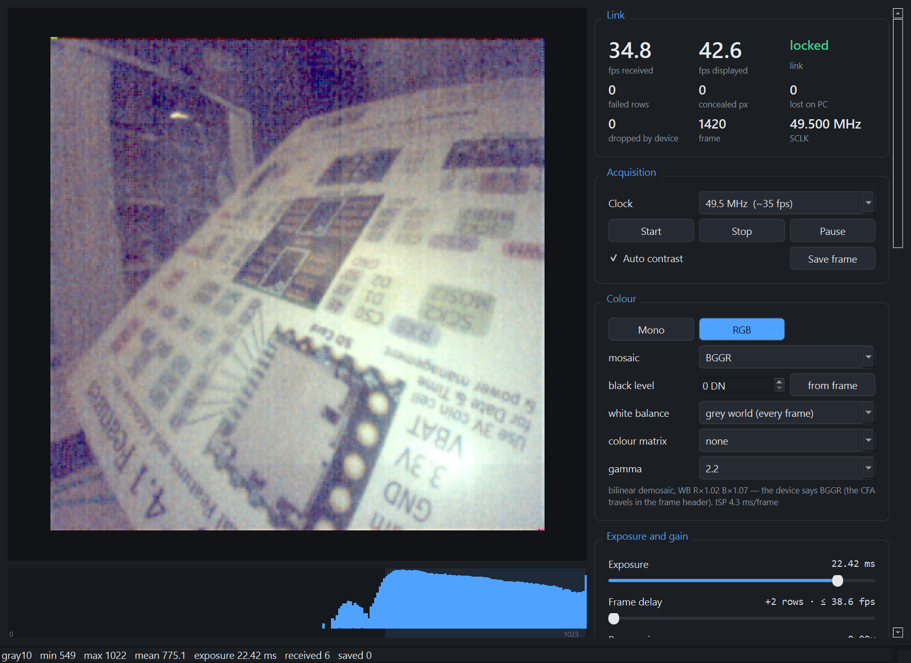
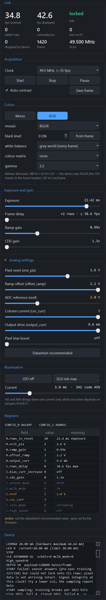

# Host software

Everything that runs on the PC: the viewer, the recorder, and the `naneye` Python package
they are built on, for your own scripts. It is Python, managed with
[uv](https://docs.astral.sh/uv/), and lives in `host/naneye`. First time? Start with
[Getting started](getting-started.md).

```bash
uv sync                  # from uv.lock
uv sync --extra saleae   # adds logic2-automation
uv sync --group docs     # adds mkdocs-material
```

## The sources abstraction

Every tool takes a `--source`, and all of them accept the same kinds. This is the
reason the host side could be built and tested before any hardware existed: `replay`
re-encodes reference frames **through the real wire protocol**, so what a tool receives is
byte-for-byte what the Teensy would send.

| `--source` | What it is |
|---|---|
| `replay` | reference frames from `build/golden`, or generated ones if that is absent |
| `auto` | the first Teensy serial port found (PJRC VID `0x16C0` preferred) |
| `COM7` | that serial port |
| a `.csv` path | a Saleae capture of the link, decoded and played back as frames |
| a file path | a recorded packet stream |

```bash
uv run python -m naneye.viewer --source doc/digital.csv
```

Pointing it at a capture decodes the raw logic-analyser export: bits sampled on SCLK rising
edges, rows found by the training-pattern alternation break, and each frame re-encoded
through the wire format so the viewer sees what it would see from the device. The clock rate
comes from the capture's own edge timing, so exposure and SCLK in the status bar are
measured rather than assumed, and per-frame start/stop-bit failures land in `rows_failed`.

Sampling a 434 MB export takes ~50 s, so the bit stream is cached under `build/golden` with
a `source.json` recording which capture produced it. An unlabelled cache is spot-checked
against the first 20,000 edges rather than trusted blindly.

`replay` no longer requires the reference capture: without it you get generated frames,
labelled `SYNTHETIC` in the source name so they cannot be mistaken for sensor data.

```python
from naneye.sources import open_source

with open_source("replay", fps=19.3) as src:
    for header, img in src.frames():
        print(header.describe(), img.shape, img.dtype)
```

## Camera GUI

The main way to look at the camera: a PyQt6 application.

```bash
uv run python -m naneye.gui                                   # live camera, 49.5 MHz
uv run python -m naneye.gui --source replay                   # no camera needed
uv run python -m naneye.gui --snapshot gui.png                # screenshot after 4 s, then exit
```



*Streaming from a colour sensor at 12.375 MHz. Everything below the image is described in
the table.*

| Panel | What it shows |
|---|---|
| **Link** | *fps received*: frames that arrived over USB intact, per second. *fps displayed*: frames painted. Link lock state, *failed rows*, *concealed px*, *lost on PC* (left the device, never arrived intact), *dropped by device* (skipped by the firmware because the PC had not taken the previous frame yet), frame counter, SCLK |
| **Acquisition** | Clock rate, Start, Stop, Pause, auto contrast, Save frame (16-bit PNG, raw values). *Start* powers the sensor and streams; *Stop* powers it off |
| **Exposure and gain** | Sliders for exposure, frame delay, ramp gain and CDS gain, each read out in real units (ms, fps, ×) |
| **Colour** | The **Mono / RGB** switch, the mosaic, and the ISP: black level, white balance, colour matrix, gamma. The caption says what the device reported and how long the ISP took |
| **Analog settings** | Sliders for the six analog fields, amber when not at the datasheet's recommended value, and a *Datasheet recommended* button. Collapsible |
| **Illumination** | The NanoBerry's LEDs: on/off, current in 0.1 mA steps with the DAC code it becomes, and the current ceiling (`LEDMAX`, default 20 mA, hardware maximum 44.6 mA). Switching on sends the current first, because the DAC powers up at zero |
| **Registers** | Both registers decoded field by field; firmware-owned fields grey |
| **Device** | Every command sent and every reply, including `START`'s sampling-point report |

Under the image is a log-scaled histogram of the raw 10-bit values, with the **display
window** shaded: the two raw values that land on 0 and on 255 on screen. Its low end is the
black level, or the auto-contrast floor when that is higher; its high end is full scale, or
the auto-contrast ceiling. Everything outside the shading is clipped, and the shading is the
only honest way to see that.

!!! note "It used to lie, and the lie was invisible"
    The window was measured on the ISP's *output* — after the black level and the white
    balance — and then drawn against an axis of raw values. With a black level of 170 DN and
    a blue gain of 1.4, the shading sat a couple of hundred DN to the left of the pixels it
    claimed to describe. Worse, the auto-contrast percentiles were taken with a stride of 2
    over the mosaic, which lands on a single Bayer site: on the colour sensor the automatic
    contrast was set by the blue pixels alone. Both are fixed; the window is now decided on
    the raw mosaic, over all four sites, and the pipeline is told to honour it.

    Green passes through white balance at gain 1.0, so a green pixel at the top of the
    window comes out at exactly 255. Red and blue land wherever their gains put them, and
    with the saturation matrix on, a green pixel reaches 246 rather than 255 because the
    matrix mixes a little red and blue back out of it. That is the matrix working, not the
    window slipping.

<figure markdown>
{ width="330" }
<figcaption>The whole side panel, top to bottom. In the window it scrolls.</figcaption>
</figure>

| Key | Action |
|---|---|
| ++plus++ / ++minus++ | longer / shorter exposure |
| ++r++ | datasheet-recommended analog settings |
| ++l++ | LED on/off |
| ++bracket-left++ / ++bracket-right++ | LED current ∓1 mA |
| ++s++ | save the frame (16-bit PNG, raw 10-bit values) |
| ++space++ | pause |
| ++q++ | quit |

The panels only ever show the device's own state or what was sent to it: the register table
and the Link panel come from each frame's header, and every command and reply is in the
Device log. The LED settings are the exception, because frames do not carry them; the GUI
sends its LED state to the device when it starts, so the two cannot disagree.

**How it keeps up.** A background thread owns the serial port and reads every packet as it
arrives; the window paints the newest frame at up to 60 Hz. So a slow repaint skips frames
*on screen* only, never in reception. The two fps figures make that visible, and the frame
accounting makes loss visible: a gap in the frame counter that the device's header accounts
for is *dropped by device*, anything else is *lost on PC*. Measured at 49.5 MHz: 35.5 fps
received, 35.5 displayed, nothing lost or dropped over 45 s.

Commands are only ever written from the window (`Device.command()`); their replies arrive
in the packet stream and are picked up by the reader thread. Nothing competes for the port.

**Recovery.** If the serial port fails, because the Teensy was unplugged or its watchdog
reset it, the link shows **RECONNECTING**. The reader closes the port and tries every second
to open it again, first under its old name, then any Teensy. Once it is back, the camera is
restarted and the slider and LED settings are written back, since a reset device comes back
with its defaults. If the port is fine but frames stop, the link shows **NO FRAMES** after
2 s, and after 5 s the camera is restarted, unless *Stop* was pressed. Everything is logged
in the *Device* panel.
The device is started only once the window and its reader are running: started earlier, it
streamed while the window was being built and dropped frames nobody was reading (124 of
them, in the measurement that found this).

**Power follows the window.** Opening the GUI powers the sensor and starts it; *Stop* sends
`STOP` then `POWER 0`, and closing the window sends `STOP`, `LED 0` and `POWER 0` before it
lets go of the port. So a closed GUI leaves the bench dark, unclocked and with the sensor's
rail down, and *Start* brings it all back — `START` power-cycles the sensor anyway. The same
is true of any `DeviceSource`, the recorder included: closing one powers the board down.

## Colour, and the ISP

A colour NanEyeC has a Bayer filter over the pixels and streams the mosaic exactly as a
mono one streams pixels: nothing in the data says which is which. So the firmware is told
once — `CFA BGGR`, kept in EEPROM — and it repeats the answer in the flags of **every
frame header**. The GUI follows that automatically and a recording is still readable years
later. The datasheet (6.3.1) fixes the pattern: the first pixel read out is the bottom-left
one and is blue, which makes the array as received **BGGR**.

The **Mono / RGB** switch decides what you look at. Mono shows the raw mosaic as it
arrives, which is what you want when measuring; RGB runs the ISP. The switch follows the
device until you touch it, after which it is yours. ++c++ toggles it.

### What the camera comes up as

The defaults are the ones that suit the colour sensor on this bench, and they live in one
dictionary, `gui.DEFAULTS`:

| | | Why |
|---|---|---|
| Clock | 12.375 MHz | the slowest of the three, and so the longest exposure the sensor allows |
| Exposure | maximum (`rows_in_reset = 0`) | the colour part sees little light; sent once, on the first frame that says where the registers are, and never again |
| Auto contrast | **off** | the ISP has a black level and a tone curve now, and a stretch on top of them fights both |
| Mode | RGB, BGGR | still switchable, and still overridden by a device that reports mono |
| Black level | 170 DN | measured on this sensor, not a datasheet figure |
| White balance | grey world, every frame | |
| Colour matrix | saturation | uncalibrated, and the picture looks right |
| Gamma | sRGB | |

Every one of them is a control in the window; this is only where they start. `--clock`
overrides the first.

### The pipeline

```
black level  ->  white balance  ->  demosaic  ->  colour matrix  ->  gamma
```

| Stage | What it does | Why it is that cheap |
|---|---|---|
| Black level | subtracts a pedestal, clipped at zero | a constant; folded into the white balance multiply |
| White balance | per-colour gain | applied on the **mosaic**, where there is a quarter of the data, as one multiply by a precomputed gain map |
| Demosaic | bilinear | separable [1,2,1] kernels, weights precomputed once per frame size, no allocation per frame |
| Colour matrix | one 3×3 | a single `matmul`, which NumPy gives to BLAS |
| Gamma | 2.2, 1.8, linear or sRGB | a 1024-entry lookup table: an array index, not a power per pixel |

**Speed is the point, not fidelity** — this is the viewfinder of a measurement camera, and
the thing that gets recorded and measured is the raw 10-bit mosaic. Measured on the bench
at 320 × 320: **2.3 ms a frame** with every stage on, 1.6 ms without the colour matrix,
0.3 ms in mono. A frame at 35 fps allows 28 ms. The GUI shows the live figure in the
Colour panel's caption, so it cannot quietly rot.

Not included, deliberately: lens shading, denoise, sharpening, defect correction, local
tone mapping. None of them would make a measurement truer, and all of them invent data.

### What is honest and what is not

| | |
|---|---|
| **Measured** | the mosaic phase: the two green sites are the (0,1)/(1,0) diagonal, by sub-lattice correlation (0.64 against 0.43) and by their response to the board's white LED (+56 DN against +40 DN) |
| **From the datasheet** | that the (0,0) corner is blue and not red. Nothing in a frame can tell red from blue, and the white LED lifts both corners equally, so this one is on the datasheet's word. If your reds and blues are swapped, the mosaic list in the panel is one click away |
| **Not calibrated** | the colour matrix. `none` is the default and is the honest one; `saturation` is a mild lift that makes the preview look like a camera and says nothing true about colour. A real matrix comes from a colour chart, which this project has not shot |
| **Not calibrated** | the black level. *from frame* takes the darkest 1 % of what is in view, which beats zero and is not a dark frame |

From Python, without the GUI:

```python
from naneye.isp import Isp
from naneye.sources import open_source

isp = Isp(pattern="BGGR", black_level=64, gamma=2.2)
with open_source("auto") as src:
    for header, raw in src.frames():
        isp.pattern = header.cfa          # the frame says what it is
        rgb8 = isp.process(raw)           # (320, 320, 3) uint8
        linear = isp.linear(raw)          # float32, pre-gamma, for measurement
```

## Lightweight viewer

The original OpenCV viewer is still there. It has fewer controls, and at 35 fps it cannot
always keep up, but it needs no Qt.

```bash
uv run python -m naneye.viewer --source auto                           # live camera, 49.5 MHz
uv run python -m naneye.viewer --source replay                         # no camera needed
uv run python -m naneye.viewer --source auto --snapshot shot.png       # one frame, no window
```

`--depth` selects 10-bit (default) or 12 (raw pixel periods, a diagnostic format).


The status bar is the point of it: frame counter and rate, min/max/mean, saturated
percentage, exposure in ms, SCLK, both config registers, and the numbers that tell you
whether to trust the data: `dropped`, `counter gaps`, `rows_failed` and `concealed`.
`SYNC LOST` turns red.

### Register panel

Beside the image, both sensor registers are decoded field by field, with each value's
meaning in real units: exposure in ms, the frame-rate ceiling, gains, voltages, drive
current. Fields marked `*` are not at the datasheet's recommended value. Grey fields marked
`(fw)` belong to the firmware (output mode, idle, and the clock bits that must match SCLK)
and cannot be changed from the viewer. ++g++ hides the panel.


*Here the camera was looking at something dark, so auto-contrast stretches a ~40 DN range
into noise.*

### Controls

With a live camera, a second window, **NanEyeC controls**, has a slider for every field
that is safe to change while streaming. Below the sliders is what each one means, and
whether it is already *in force on the sensor* or still *sending*.


| Slider | Field | What it does |
|---|---|---|
| exposure | `rows_in_reset` | right = longer. 1.3–102 ms at 12.375 MHz, half that at 24.75 MHz |
| delay | `rows_delay` | adds 16n + 2 rows per frame: slower frame rate, longer maximum exposure |
| ramp gain | `ramp_gain` | ADC gain 0.79× / 0.99× / 1.32× / 1.97× |
| CDS gain | `cds_gain` | column amplifier 1.3× / 2.0× |
| vrst | `vrst_pix` | pixel reset voltage |
| offset | `offset_ramp` | ADC ramp offset voltage |
| vref | `vref` | ADC reference; sets the black level |
| cvc | `cvc_curr` | column converter current; affects column noise |
| drive | `output_curr` | SDAT output drive, 3.9–9.6 mA; lower is quieter but gives slower edges |
| bias+ | `bias_curr_increase` | pixel bias current |

A change is sent once the slider has been still for 0.15 s, as a write of the whole
register, and takes effect on the next frame. The device stays the source of truth: the
sliders start from the registers in the first frame, and the firmware-owned bits are always
taken from the latest frame. All of this was checked on hardware, including frame delays up
to 31, with no failed rows.

!!! note "Recommended is not automatically better"
    ++d++ sets the datasheet's recommended analog values. On the same dark scene at
    24.75 MHz, `vref` 1 → 2 lowered the black level by 76–130 DN (more usable range), but
    `cvc_curr` 3 → 1 doubled the column fixed-pattern noise (4.3 → 8.4 DN). `vref = 2` with
    `cvc_curr = 3` measured best. That is one scene and one clock rate, not a
    characterisation.

| Key | Action |
|---|---|
| ++q++ / ++esc++ | quit |
| ++s++ | save the current frame as PNG |
| ++r++ | raw vs autoscaled contrast |
| ++h++ | histogram on/off |
| ++g++ | register panel on/off |
| ++d++ | datasheet-recommended analog settings (moves the sliders) |
| ++space++ | pause |
| ++plus++ / ++minus++ | longer / shorter exposure (moves the exposure slider) |
| ++l++ | LED on/off |
| ++bracket-left++ / ++bracket-right++ | LED current ∓1 mA |

The register model behind all this is `naneye.regs`: every field with its position, units,
recommended value and whether it is safe to edit, plus the exposure and frame-period maths.

```python
from naneye import regs
print("
".join(regs.describe(0x009F, 0x005C, sclk_hz=24.75e6)))
c0, c1 = regs.pack({"ramp_gain": 2, "rows_delay": 4}, 0x009F, 0x005C)
```

`--snapshot` composes exactly what the window shows and writes it to a file: handy for bug
reports and for documenting a setup. The viewer holds the serial port while it is open, so
close it before running a script or the recorder.

## Recorder

```bash
uv run python -m naneye.record --source auto --frames 1200 --out capture/run1
uv run python -m naneye.record --source auto --seconds 60 --exposure 64 --out capture/run2
uv run python -m naneye.record --source auto --seconds 600 --no-frames --out capture/soak
```

Per run:

| File | Contents |
|---|---|
| `frames.npy` | `(N, 320, 320)`, `uint16` |
| `meta.csv` | one row per frame: counter, timestamp, exposure, config, drop counters, failed rows, concealed pixels, min/max/mean |
| `run.json` | settings and a summary: measured fps, frames *dropped by device* and *lost on PC* (kept apart, as in the GUI), failed rows, concealed pixels, and packets the host rejected (`host_bad_crc`, `host_resyncs`) |
| `stream.bin` | with `--raw`, every packet header |

**Frames go to disk as they arrive**, so memory stays flat however long the run. They are
written to `frames.bin` and `meta.csv` is flushed as it goes, so if the recorder dies,
everything received so far is still there:
`np.fromfile("frames.bin", np.uint16).reshape(-1, 320, 320)`. At the end `frames.bin` is
copied into `frames.npy` in chunks and removed (`--keep-bin` keeps it). Mind the disk: at
49.5 MHz, 10-bit data is about 7 MB/s, so a 10-minute run is about 4.3 GB, and briefly
twice that while `frames.npy` is assembled.

`--no-frames` writes only `meta.csv` and `run.json`: every frame's header and statistics,
no pixels. That is what a soak test of the link needs.

For a live device the recorder starts the camera itself, once it is already reading, and
ignores anything from an earlier stream until `START` has answered, so no frames pile up
unread at the start. `--seconds` times the run instead of counting frames.

A recording is **self-describing**: every frame carried its own exposure, gain, clock rate
and drop counters in its header, so nothing has to be remembered separately. For measurement
work that matters more than it sounds — it is what lets you come back to data months later
and still know what it is.

```python
import json, numpy as np
frames = np.load("capture/run1/frames.npy")
meta = json.load(open("capture/run1/run.json"))
assert meta["lost_on_pc"] == 0 and meta["dropped_by_device"] == 0
assert meta["rows_failed_total"] == 0
dark = frames.mean(axis=0)
print("temporal noise", frames.astype(float).std(axis=0).mean(), "DN")
```

## Decoding

`naneye.decode` is the canonical decoder, used for live frames, Saleae captures and the
golden-capture tool alike.

```python
from naneye import decode

# Device payloads
img = decode.decode_payload(header, payload)      # -> (320, 320)
img = decode.raw12_to_image(raw)                  # drop per-row training words

# Pixel periods from 32-bit words (mirrors the firmware exactly)
pp = decode.words_to_pp(words, decode.ROW_PP)
ok = decode.validate_pp(pp)                       # start=1, stop=0
px = decode.pp_to_pixels(pp)

# Logic-analyser captures
bits, times = decode.sample_saleae_csv("capture.csv")
for i, img, stats in decode.decode_frames_from_bits(bits):
    assert stats["bad_start_bits"] == 0
idx, lens = decode.find_clock_gaps(times, threshold_s=1e-6)
writes = decode.decode_register_writes(bits[:200])
```

`decode_frames_from_bits` finds rows by the
[alternation break](seim.md#finding-row-boundaries) and yields only frames whose row pitch is
exactly 3936 bits, so a malformed capture is skipped rather than silently mis-decoded.

## Protocol

`naneye.protocol` mirrors `firmware/src/usb_proto.h`. A 52-byte little-endian header, CRC-32
over header bytes 0–47 plus the payload, then the payload.

```python
from naneye import protocol
h = protocol.Header.unpack(buf)
print(h.describe(), h.exposure_us(), h.sync_lost)
```

`transport.PacketReader` resynchronises on the magic word and verifies every CRC, so a
corrupted or partial packet costs one frame rather than the stream. It works over any
`read(n)` callable — serial port, socket, file, `BytesIO` — which is what makes it testable.

```python
from naneye.transport import Device
with Device.open_first() as dev:
    print(dev.ask("ID"))
    print(dev.ask("SELFTEST"))
    dev.command("START")
    for pkt in dev.frames():
        ...
```

## Commands

The firmware takes plain text lines; replies come back framed, so use `Device.ask()` rather
than a serial terminal. Commands are processed between frames, so a reply can take up to one
frame period to arrive while streaming.

| Command | What it does |
|---|---|
| `ID` | firmware version, actual SCLK, registers, format, last reset cause |
| `CLK 49500000` | SCLK rate: `49500000` (~35 fps), `24750000` (~18 fps) or `12375000` (~8 fps). The host tools default to 49.5 MHz |
| `START` | power-cycle the sensor, start it, choose the sampling point, lock onto its rows, check 8 rows, stream (takes ~1.2 s). The reply reports what the calibration measured |
| `STOP` | stop streaming (the sensor stays powered, in idle) |
| `POWER 0` / `POWER 1` | sensor power; switching on waits until it has been off ≥ 1 s |
| `DEPTH 10` / `12` | packed 10-bit (default), or raw 12-bit pixel periods (diagnostic) |
| `EXP <rows_in_reset> [rows_delay]` | exposure: 0 longest (~102 ms at 12.375 MHz) … 159 shortest (~1.3 ms); `rows_delay` slows the frame rate |
| `REG <reg> <0xHHHH>` (reg 0 or 1) | raw register write, validated |
| `LED 0` / `LED 1`, `LEDI <mA>`, `LEDMAX <mA>` | illumination: on/off, current (clamped, default ceiling 20 mA), raise the clamp up to 44.6 mA. `LED 1` alone gives almost no light; set `LEDI` first |
| `STATS` | frame counters and link state |
| `SELFTEST` | check decoding and exposure maths against the embedded reference row |

Diagnostic commands (`LISTEN`, `PROBE`, `START REF`, `CAL`, `SAMPLE`, `PHASE`, `HYS`)
are described in
[Firmware: diagnostics](firmware.md#diagnostics).

## Tests

```bash
uv run pytest          # 112 tests, none needing hardware
```

| File | Covers |
|---|---|
| `test_protocol.py` | every header field offset against the firmware's `static_assert`s, CRC behaviour |
| `test_unpack.py` | pixel extraction against the golden row, lossless 10-bit packing |
| `test_transport.py` | CRC rejection, resync past junk, truncation, drop accounting |
| `test_golden.py` | the reference capture: row pitch, start/stop bits, noise, mono, registers, the gap defect |
| `test_sources.py` | replay path resolution, the synthetic fallback, lossless replay round-trip |
| `test_device.py` | the `Device` command/reply logic against a simulated serial port |
| `test_regs.py` | the register model: field layout, round trips, exposure maths against the firmware and the device |
| `test_gui.py` | the Qt GUI, headless: loss accounting (device drops vs PC losses), frame hand-over, reconnecting after the port fails, and a smoke test on replayed frames |
| `test_record.py` | the streaming recorder end to end: `frames.npy` against `meta.csv`, the raw stream, `--no-frames`, the raw 12-bit format |
| `test_link_quality.py` | the link-quality analysis: alignment search, framing-error counting, and the limit that data-bit errors are invisible |

Tests needing the 434 MB capture skip cleanly when it is absent. `test_unpack.py` parses the
generated `golden_vector.h` so the Python decoder is held to the exact data the device's
`SELFTEST` checks itself against — the C and Python implementations cannot diverge silently.

## Tools

```bash
uv run python tools/decode_golden.py [capture.csv] [--out build/golden]
uv run python tools/make_golden_vector.py --row 200
```

`decode_golden.py` is the reference decode and the regression baseline: it reports clock
rate, register writes with fields expanded, per-frame validation, temporal noise and the
mono check. It caches `bits.npy`, so only the first parse costs ~50 s.

`make_golden_vector.py` regenerates the firmware's embedded test row. Pick a clean row —
rows 129 and 262 of the reference frame 1 contain the host's
[clock-gap corruption](seim.md#things-the-reference-capture-taught-us).

With a Saleae logic analyser and its Logic 2 software running (MCP server enabled), these
capture the live link and analyse it; `host/naneye/saleae.py` is the client they share:

| Tool | What it does |
|---|---|
| `tools/device_check.py` | ID, SELFTEST and STATS; no analyser needed |
| `tools/link_quality.py` | word error rate at every sampling point, at a given clock; no analyser needed |
| `tools/show_bringup.py` | triggers on sensor power-up, runs a start command and plots what happened |
| `tools/check_alignment.py` | shows where each row transfer lands relative to the sensor's rows |
| `tools/capture_link.py`, `tools/analyze_link.py` | general captures: clock rate, phase counts, register writes |
