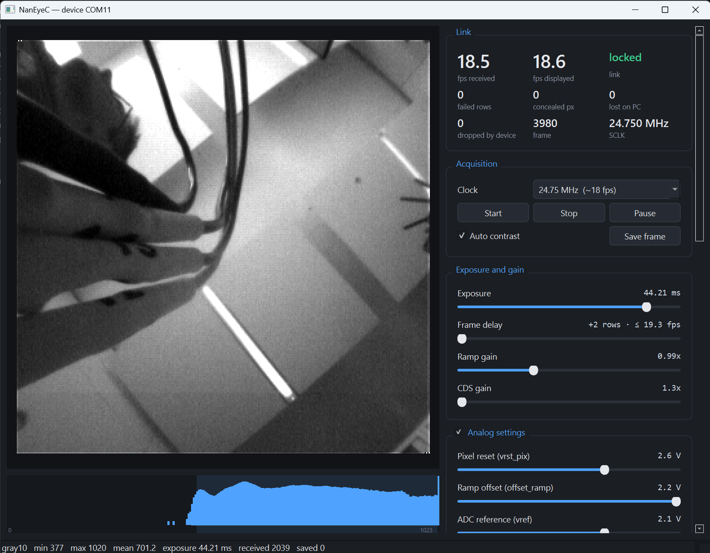

# NanEyeC on Teensy 4.1

This project turns an **ams-OSRAM NanEyeC**, a 1 mm² camera sensor, into a USB camera for a
Windows PC. The sensor sits on an ams **NanoBerry** evaluation board, a **Teensy 4.1**
microcontroller talks to it, and the PC receives 320 × 320 monochrome images at up to
35 frames per second, with Python tools to view and record them.

Frames keep the sensor's full 10-bit resolution. Every frame carries its own exposure,
clock and error counters, and a lost or damaged frame is always reported, never hidden.


*The bench: the Teensy 4.1 (green, left) on a breadboard, wired to the NanoBerry board (black,
right) through its Raspberry Pi header. The red box is a Saleae logic analyser probing the
link, used during development and not needed to run the camera.
[Hardware](hardware.md#the-bench-in-the-photo) walks through the photo.*



*What you get: the viewer streaming from the sensor. There is a frame counter
and rate, pixel statistics, the exposure and register settings, the error counters, and a
histogram.*

## Status

| | |
|---|---|
| Streaming images | **working** since 2026-09-18 |
| 49.5 MHz link (default) | **35.5 fps**; 10 minutes without a lost frame, a failed row or a concealed pixel ([how](hardware.md#clock-rates)) |
| 24.75 / 12.375 MHz | 17.9 / 8.4 fps, 0 failed rows |
| Error handling | sampling point measured at every start; broken pixel words detected and concealed |
| Exposure control | verified: brightness follows exposure linearly from 1.3 to 102 ms |
| Watchdog | hardware watchdog resets a hung Teensy within 2 s |
| Illumination (the board's LEDs) | **working**: DAC writes verified on the wire, image brightness linear at 1.98 DN/mA to 20 mA |
| Host software | PyQt6 camera GUI, recorder, Python API; 85 automated tests, no hardware needed |

## Where to go

| I want to… | Read |
|---|---|
| build one and see an image | [Getting started](getting-started.md) |
| understand the wiring, the board, or why something is wired the way it is | [Hardware and bring-up](hardware.md) |
| record data or use the camera from Python | [Host software](host.md) |
| change the firmware | [Firmware architecture](firmware.md) |
| understand the sensor's serial protocol | [SEIM protocol reference](seim.md) |
| know why a decision was made | [Design record](design.md) |
| know where the code departs from the datasheet, and why | [Datasheet cross-check](datasheet-crosscheck.md) |
| look up a term (PP, SEIM, training pattern…) | [Glossary](glossary.md) |
| know how the project was developed and brought up with Claude | [How this was built with Claude](built-with-claude.md) |

## How it works, in one paragraph

The NanEyeC has only four pins: power, ground, a clock input (**SCLK**) and one data line
(**SDAT**) that works in both directions, taking turns. The host supplies the clock. For
most of each frame the sensor sends pixels on SDAT, one bit per clock. Between frames there
is a short *interface window* where the direction reverses and the host can write the
sensor's two configuration registers. The Teensy generates the clock and receives the bits
with its SPI peripheral and DMA, checks every row, packs the pixels and sends each frame to
the PC over USB with a header and a checksum. On the PC, Python code decodes and displays
the frames. The [SEIM protocol reference](seim.md) has the details.

## A note on how this was built

The specification, firmware, host software, tests and these pages were written by Claude
(Anthropic's AI model) in Claude Code, which also did the bring-up on the bench, driving the
Teensy over USB and a logic analyser through its MCP server. A person did the wiring, made
the decisions and caught the mistakes. [How this was built with Claude](built-with-claude.md)
tells that story, including the mistakes.

Almost nothing here was taken on trust from the datasheet. Before any code was written, a
logic-analyser capture of a **working** NanoBerry ↔ Raspberry Pi link was decoded
completely. It gave hard numbers for the clock rate, the sampling edge, the register
sequence and the timing, and it exposed a defect in that reference implementation worth
avoiding. Where measurement and datasheet disagree, the measurement wins, and the
[datasheet cross-check](datasheet-crosscheck.md) records each case.

That capture, the datasheets and the board schematic are **not in this repository**. They
are third-party material and the repository is public. One real row of sensor data *is*
committed, as `firmware/src/golden_vector.h`; the on-device self-test and the host tests
check against it. `.gitignore` lists the files that belong in the local `doc/` folder and
where each comes from.

## Repository layout

```
README.md               short introduction
spec.md                 living design record (shown here as "Design record")
docs/                   this site
doc/                    NOT tracked: datasheets, schematic, reference capture
firmware/               PlatformIO project for the Teensy 4.1
host/naneye/            Python package: decoder, transport, viewer, recorder, Saleae client
tools/                  reference-capture decoder, logic-analyser bring-up tools
tests/                  85 tests, none needing hardware
```

## Building these docs

```bash
uv sync --group docs
uv run mkdocs serve      # http://127.0.0.1:8000
```

The site is published to <https://fiepfiep.github.io/teensy_naneyeC/> on every push that
touches the docs.
